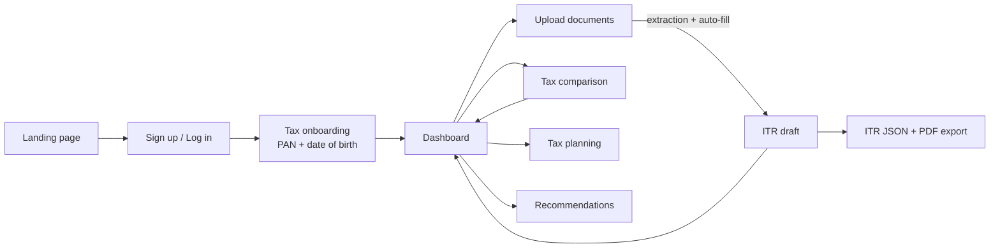
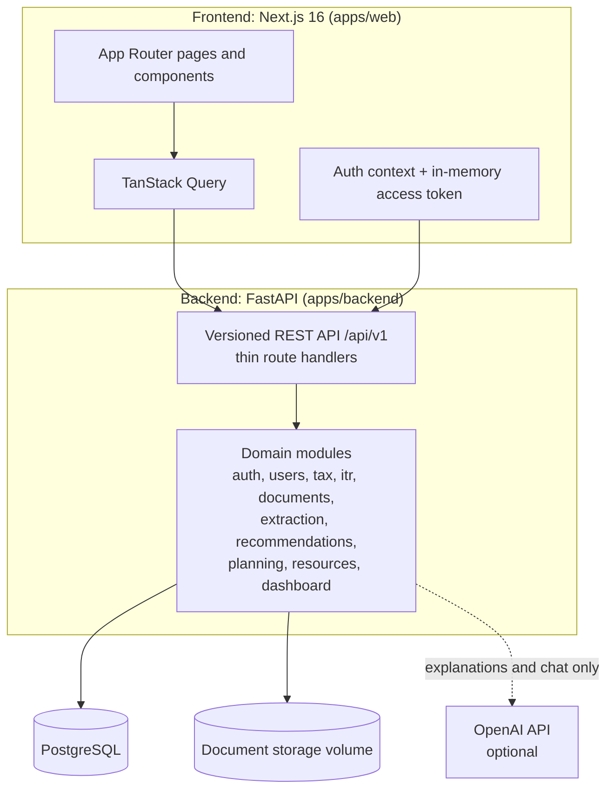

# MoneyMitra

**An AI-assisted personal tax and finance companion for Indian salaried taxpayers.**

MoneyMitra brings a salaried user's tax information, documents, tax calculations,
tax-saving advice and ITR preparation into one workspace, so they can understand
and manage their taxes throughout the year instead of only thinking about them
at filing time.

---

## Table of contents

1. [Overview](#1-overview)
2. [Feature summary](#2-feature-summary)
3. [Product walkthrough](#3-product-walkthrough)
4. [Feature details](#4-feature-details)
5. [Architecture](#5-architecture)
6. [Tech stack](#6-tech-stack)
7. [Data model](#7-data-model)
8. [API overview](#8-api-overview)
9. [Security and privacy](#9-security-and-privacy)
10. [How AI is used (and where it is not)](#10-how-ai-is-used-and-where-it-is-not)
11. [Tax rules reference](#11-tax-rules-reference)
12. [Repository structure](#12-repository-structure)
13. [Getting started](#13-getting-started)
14. [Configuration](#14-configuration)
15. [Testing and quality](#15-testing-and-quality)
16. [Known limitations and next steps](#16-known-limitations-and-next-steps)
17. [Presentation guide](#17-presentation-guide)

---

## 1. Overview

### The problem

For a salaried person in India, the information needed to make good tax
decisions is scattered: payslips in email, Form 16 in a downloads folder,
investment proofs in photos, rent details in a chat, and the tax maths in a
spreadsheet, if it exists at all. Most people only look at it when the filing
deadline arrives, which is too late to act on deductions.

### The solution

MoneyMitra keeps those pieces together and keeps them current:

- **Upload** payslips, Form 16, AIS and PAN documents.
- **Understand**: the documents are read and organised automatically.
- **Compare** the old and new tax regimes on the user's real numbers.
- **Act**: tax-saving advice that always says why it applies, with a monthly
  plan for the deductions that are still open this year.
- **File**: work out which ITR form applies (ITR-1, ITR-2 or ITR-3) from the
  documents, prepare the return and export it for upload to the e-filing portal.

### Guiding principles

- **Never invent financial data.** Every number on the dashboard exists only
  because the user supplied the data behind it (see
  [Progressive dashboard](#progressive-dashboard)).
- **Deterministic maths, optional AI.** Tax figures come from versioned,
  testable rules. AI only explains or answers questions, and the product works
  without it.
- **Every recommendation has a reason.** Advice states what it is based on.
- **Backend-first.** The API holds all business logic; the website is a client,
  so a mobile app could reuse it unchanged.

---

## 2. Feature summary

| Module | What it does | Status |
|---|---|---|
| **Authentication** | Sign up, log in, rotating refresh sessions, protected routes | Live |
| **Tax onboarding** | Post-signup PAN and date-of-birth step (skippable, completable later) | Live |
| **Dashboard** | Income, estimated tax, savings, documents, recommendations, activity, all driven by real user data | Live |
| **Documents** | Upload and manage ten document types; automatic extraction from Form 16, AIS, Form 26AS, payslips and broker statements | Live |
| **Tax Comparison** | Old vs. new regime for FY 2025-26 and FY 2026-27, with deduction checklist | Live |
| **AI tax explanation and chat** | Plain-language "why" and a tax Q&A assistant (requires an OpenAI key) | Live, optional |
| **Tax Planning** | Remaining deduction headroom and monthly targets for the current financial year | Live |
| **ITR Filing** | Four-step ITR-1, ITR-2 and ITR-3 preparation for AY 2026-27, with the right form chosen from your documents; JSON and PDF export | Live |
| **Recommendations** | Life-stage guidance on making your existing money work harder, with worked numbers, steps and options, that gets more specific as data is added | Live |
| **Resources and Alerts** | Government deadlines, deduction limits, slab explorer | Live |
| **Landing page** | Product-led marketing page with light and dark themes | Live |
| **Finance Management** | Spending, investments and savings views | Prototype (demo data only) |

---

## 3. Product walkthrough



A typical journey:

1. **Land and sign up.** Authentication and tax onboarding are separate steps.
   Signup collects only identity; the next screen asks for PAN and date of birth,
   with a "Skip for now" option.
2. **Dashboard starts honest.** A brand-new user sees clear empty states and
   exactly what to add to unlock each card.
3. **Add information.** Either enter income through the tax comparison or upload
   documents. Uploads fill the ITR draft automatically.
4. **Numbers appear.** The dashboard, comparison, recommendations and plan all
   update from the same underlying data.
5. **Plan and file.** Use tax planning to pace deductions through the year, then
   prepare and export the ITR. MoneyMitra recommends the form (ITR-1, ITR-2 or
   ITR-3) from the uploaded documents.

---

## 4. Feature details

### Authentication and sessions

- Email and password sign-up and login; passwords are hashed with bcrypt.
- Short-lived **access token** (15 minutes, kept in memory only) plus a
  **refresh token** (30 days) in an HttpOnly cookie. Refresh tokens are stored
  hashed, rotated on every use, and revoked on logout.
- Protected routes are guarded in the frontend and, independently, on every
  API call.

### Tax onboarding

After a user first authenticates, a separate page collects **PAN** and
**date of birth** (format-validated, with a masked PAN returned by the API).
Skipping is allowed and never blocks access; the details can be added later
from Profile / Settings. Authentication and tax onboarding are deliberately
independent concerns.

### Progressive dashboard

The dashboard renders only what the user's data supports:

| User state | What the dashboard shows |
|---|---|
| New user, nothing provided | Empty states everywhere, with the next step for each card |
| Profile only (date of birth) | Money cards stay empty; recommendations card explains what unlocks the next level |
| Income entered | Real annual income, estimated tax, both regime totals, savings, and income-based recommendations |
| Payslip uploaded | Income and tax derived from the payslip via the ITR draft |
| Form 16 uploaded | Form 16 shown as processed; income and tax from the document |

Recent activity lists only real events (uploads, saved tax details). When two
regimes cannot be compared (for example, a belated return where only the new
regime applies), the dashboard still shows the estimated tax under the regime
that applies and says plainly why no comparison is available. The estimate
covers tax and cess only, before any interest or late-filing fee.

### Documents and automatic extraction

- **Categories (ten):** PAN card, Form 16, AIS, Form 26AS, payslips, capital
  gains and trading statements, home-loan certificate, tax proofs, bills, other.
- **Upload:** PDF, PNG, JPEG, and AIS JSON; content is checked by file
  signature, not extension; 10 MB limit; stored on a Docker volume with
  metadata in the database. Re-uploading an identical file is detected by its
  SHA-256 hash and refused, with a message saying where it already is.
- **Extraction is rule-based, not AI.** It reads text PDFs and AIS JSON for:
  TRACES Form 16 (Parts A and B), the e-filing AIS (including the taxpayer
  information summary and securities sales), Form 26AS, broker capital-gains /
  tax P&L statements, payslips with Current/YTD columns, and PAN cards.
  Password-protected AIS PDFs are opened using the user's PAN and date of birth.
  Home-loan certificates, tax proofs, bills and other documents are stored but
  not read.
- **Scans and photos are read with local OCR.** Photographed PAN cards and
  scanned PDFs (up to 10 pages) go through Tesseract running on the server, so
  no document leaves the machine. If OCR is not installed, or a file still
  cannot be read, it is reported as unreadable rather than guessed at.
- **Auto-fill rules:** only empty fields are filled; values the user typed are
  never overwritten; every filled field is tagged with its source ("from Form 16").

### Tax Comparison (old vs. new regime)

- Supports **FY 2025-26** and **FY 2026-27**.
- Inputs: gross total income, date of birth (for the age category), and
  deductions: Section 80C, 80D, HRA exemption, home-loan interest, NPS, and others.
- Output for each regime: deductions, taxable income, slab-by-slab breakdown,
  Section 87A rebate, surcharge, cess, and total tax, plus the recommended
  regime and the difference between them.
- A **deduction checklist** shows each section's limit, the declared amount,
  the remaining headroom, and qualifying instruments.
- The latest inputs are saved so other modules (dashboard, recommendations,
  planning) can reuse them.

### AI tax explanation and assistant

- **"Why" explanation:** plain-language notes on the comparison, generated from
  the computed numbers. If the AI is unavailable, a deterministic template built
  from the same numbers is used instead.
- **Tax chat:** a stateless Q&A assistant for general tax questions and for the
  current comparison. Numbers it quotes about the user's calculation must come
  from the supplied data.
- Both are optional: without an OpenAI key the rest of the product is unaffected.

### Tax Planning

Answers "how much deduction room is left this financial year, and what does that
mean per remaining month?" while there is still time to act.

- Per section (80C, 80D, 24(b) home-loan interest, 80CCD(1B) NPS): cap, amount
  already declared, remaining headroom, and a **monthly target** for the months left.
- Age-aware 80D cap (senior citizens get a higher limit).
- Instrument options for each section with lock-in and why they may suit the user.
- Shows the regime position (which regime is cheaper) with an honest caveat.
- **Year-aware.** The plan is for the *current* financial year, but saved
  figures (an ITR draft, a tax comparison) are often for the previous one (an
  ITR for AY 2026-27 is FY 2025-26). Last year's investments are not this
  year's progress, so progress counts only when the figures are for the current
  year; otherwise headroom restarts from zero and last year's amount is shown
  as a reference, with a banner explaining it. Home loan interest, which
  repeats by itself, is carried forward and has no monthly target.
- **What the regime estimate counts:** salary and interest/dividend income,
  HRA (from the ITR computation), 80C, 80D for yourself and your parents (each
  under its own limit), home loan interest and NPS 80CCD(1B). It leaves out
  rental income, the employer's NPS contribution (80CCD(2)) and deductions such
  as 80E and 80TTA, and the page says so.

### ITR Filing (ITR-1, ITR-2 and ITR-3, AY 2026-27)

A four-step flow: **Personal Info, Income Sources, Tax Saving, Tax Summary.**

- **The right form, chosen for the user.** A "Your ITR form" card recommends
  ITR-1, ITR-2 or ITR-3 from the uploaded documents, explains why, and lists the
  documents still needed. For example: capital gains beyond the ITR-1 limit or
  income above Rs 50 lakh point to ITR-2; intraday or F&O trading points to ITR-3.
- **What each form covers.**
  - **ITR-1:** salary or pension, up to two house properties, other sources.
  - **ITR-2:** adds capital gains on listed shares and mutual funds (Sections
    111A, 112A and 50AA), set-off, special-rate tax and TDS.
  - **ITR-3:** adds share trading as business income without books of account,
    both intraday (speculative) and F&O (non-speculative). It has a later due
    date than ITR-1 and ITR-2.
- **Honest about what is not built.** Cases that need schedules MoneyMitra does
  not build yet are shown as blockers on the card instead of producing a wrong
  return: other business or professional income, non-residents, foreign assets
  or income, income above Rs 50 lakh, house property in ITR-2 or ITR-3, and the
  old regime in ITR-2 or ITR-3 (choose the new regime).
- Auto-fills from uploaded documents, auto-saves as the user types, and can
  re-read documents on demand.
- Computes tax under both regimes where allowed, including interest under
  234A/B/C and fee under 234F, with eligibility and field validation.
- **Exports** the official e-filing JSON, validated against the Income Tax
  Department's schema for the chosen form (ITR-1 v1.1, ITR-2 v1.2, ITR-3 v1.1),
  plus a human-readable **PDF summary**.
- After the due date (31 Jul 2026) only the new regime is allowed (belated
  return u/s 139(4)), and the product enforces this.
- MoneyMitra does **not** submit returns. The user uploads the JSON at
  incometax.gov.in and e-verifies it; direct submission requires ERI
  registration with the Income Tax Department.

### Recommendations

Life-stage guidance on **how to make your existing money work harder**. It is
the product's central feature, and it is rule-based (no AI writes the advice),
so every number can be reproduced. Tax-saving advice lives elsewhere (Tax
Comparison, Tax Planning, ITR Filing).

Each stage of life gets five pieces of advice:

| Stage | Advice |
|---|---|
| **Career Start** (under 30) | Build an emergency fund and keep it earning; don't leave idle money in a savings account; start investing every month; protect your income (health and term cover); pay off expensive debt first |
| **Mid-Career** (30-49) | Put idle savings to work; work out your retirement number and close the gap; check your growth-vs-safety split; cover the people who depend on you; give each big goal its own money and timeline |
| **Pre-Retirement** (50+) | Shift gradually from growth to safety; plan the monthly income that replaces your salary; put idle money to work; lock in health cover before you retire; make sure nominations and a will are in place |

Every recommendation is built to be understood and acted on, not just read:

- **What to do and why**, in plain language.
- **A worked example** with real rupee figures, such as "what ₹1,80,000 earns in
  a year in a savings account vs a fixed deposit", or "what ₹10,000 a month
  grows to over 10, 20 and 30 years". The numbers use the best income figure
  available: documents, then declared figures, then expected income, then a
  clearly labelled sample income of ₹50,000 a month.
- **Step-by-step how-to** and **where the money can go**, described by type
  with a risk label. No specific product or fund is ever recommended.
- **What it is based on**, e.g. "From your Form 16 and AIS".

**The rates are illustrative assumptions**, kept in one file
(`recommendations/wealth.py`): about 3% for a savings account, 6.5% for fixed
deposits and liquid funds, 10% for long-term equity-oriented investing, and 6%
inflation. They are shown next to every example, and the page carries a
disclaimer that this is general guidance, not personal investment advice.
Review and update them before real use.

The levels describe how much MoneyMitra knows, and they change how specific the
numbers are:

| Level | Built on | What changes |
|---|---|---|
| 0 | Nothing yet | A prompt to add a date of birth |
| 1 | Profile: date of birth, plus optionally employee category and expected income | Example figures, or yours if you gave an expected income. Employee category sets the emergency fund (4 months of expenses for government and PSU jobs, 6 otherwise) |
| 2 | Income from the ITR draft or latest tax comparison | The numbers use your real income, and health-cover advice reads your declared premiums |
| 3 | Uploaded Form 16, AIS, Form 26AS, payslips and broker statements | Income comes from your documents. With an AIS, MoneyMitra estimates how much of your money sits idle in savings accounts from the interest you earned, and how much more it could earn in a deposit |

Life stage comes from age, with the cut-offs in `recommendations/stages.py`.
For Level 3, MoneyMitra builds an ITR draft from your documents alone using the
same extraction code as the ITR auto-fill; the saved draft is never changed.
The page lists which documents were analysed and why any others were skipped (a
PAN card only identifies the user; files that can't be read, even with OCR, are skipped; document types such as
tax proofs, bills and home-loan certificates are stored but not analysed), so it
is always clear why a user is or isn't on Level 3. Form 16, AIS, Form 26AS,
payslips and broker statements are all analysed.

Where the code lives (`apps/backend/app/modules/recommendations/`):

```
facts.py              # gathers profile, declared figures and document analysis; picks the level
life_stage.py         # the advice for each stage, with the worked examples
wealth.py             # the illustrative rates and the compounding arithmetic
context.py            # declared figures from the ITR draft or tax comparison (most recent wins)
document_analysis.py  # Level 3: documents -> draft -> ITR computation
engine.py, rules.py   # run the rules and work out the "next step"
profile.py            # employee category, expected income, date of birth
```

To add or change advice, edit a builder in `life_stage.py` and list it for its
stage in `BUILDERS`.

### Resources and Alerts

A curated reference page: government deadlines (ITR filing, advance tax
instalments, last date for tax-saving investments), a deduction-limits lookup,
and a slab explorer by tax year and age category. The deadline list is
**maintained by hand** because the official feeds are not publicly consumable.

### Landing page

A product-led page: hero with a live-looking product mockup, value strip,
feature cards, how-it-works, product showcase and call to action. Includes
subtle scroll animations that replay on re-entry and respect
`prefers-reduced-motion`, and supports light and dark themes.

### Finance Management (prototype)

Overview, expenses, investments, tax and insights views built on demo data and
clearly marked as such. No backend exists for it yet.

---

## 5. Architecture



Design decisions:

- **Modular monolith.** Each domain lives in `app/modules/<name>/` (models,
  schemas, service); route handlers in `app/api/v1/` stay thin.
- **API-first.** The frontend contains presentation and no business rules.
- **Versioned tax rules.** Slabs, rebates and caps are data
  (`TaxYearRules`, `ItrYearRules`), so a new year is a new rules entry, not a
  rewrite.
- **Reuse over duplication.** The dashboard, recommendations and planning all
  read one shared "financial context" (latest ITR draft or saved tax comparison)
  so they can never disagree.
- **Graceful degradation.** AI failures fall back to deterministic text and
  never block a calculation.

---

## 6. Tech stack

| Layer | Technology |
|---|---|
| Frontend | Next.js 16 (App Router), React 19, TypeScript, Tailwind CSS 4, TanStack Query, next-themes, lucide-react |
| Backend | Python 3.12, FastAPI, Pydantic, SQLAlchemy 2, Alembic |
| Database | PostgreSQL (psycopg 3) |
| Auth and crypto | bcrypt, PyJWT, `cryptography` (Fernet) |
| Documents | pypdf for text extraction, Tesseract OCR (pytesseract, pypdfium2) for scans and photos, reportlab for PDF summaries, jsonschema for ITR export validation |
| AI (optional) | OpenAI API (model configurable, default `gpt-4.1-mini`) |
| Tooling | pytest, ruff, ESLint, `tsc`, Docker and Docker Compose |

---

## 7. Data model

| Table | Purpose |
|---|---|
| `users` | Identity, date of birth, encrypted PAN, tax-onboarding status, recommendation profile (employee category, expected income) |
| `refresh_tokens` | Hashed, rotating session tokens |
| `documents` | Uploaded file metadata and extraction status (files are on disk) |
| `itr_filings` | One ITR draft per user and assessment year, with auto-fill sources |
| `tax_comparison_snapshots` | The user's latest comparison inputs, reused by other modules |

Schema changes are managed by Alembic migrations in `apps/backend/alembic/versions/`.

---

## 8. API overview

All routes are under `/api/v1` and (except health and auth) require a bearer token.
Interactive docs: `http://localhost:8000/docs`.

| Area | Endpoints |
|---|---|
| Health | `GET /health` |
| Auth | `POST /auth/signup`, `/auth/login`, `/auth/refresh`, `/auth/logout`; `GET /auth/me` |
| Tax onboarding | `PUT /users/me/tax-profile`; `POST /users/me/tax-onboarding/skip` |
| Dashboard | `GET /dashboard/summary` |
| Documents | `GET /documents`; `POST /documents`; `GET /documents/{id}/file`; `DELETE /documents/{id}` |
| Tax | `GET /tax/years`; `POST /tax/comparison`; `GET /tax/slabs`; `POST /tax/explain`; `POST /tax/chat` |
| Planning | `GET /planning/tax-plan` |
| ITR | `GET /itr/assessment-years`; `GET`/`PUT /itr/filings/{ay}`; `GET /itr/filings/{ay}/summary`; `POST .../export`; `POST .../reread-documents`; `GET .../export/pdf` |
| Recommendations | `GET /recommendations` (level, life-stage advice, next step, documents analysed, disclaimer); `PUT /recommendations/profile` |
| Resources | `GET /resources` |

---

## 9. Security and privacy

- **Passwords** are hashed with bcrypt and never returned by the API.
- **Sessions:** 15-minute access tokens held in memory; refresh tokens in an
  HttpOnly, SameSite cookie, stored hashed, rotated atomically on use (a reused
  token is rejected), and revoked on logout.
- **PAN** is encrypted at rest with Fernet and exposed only in masked form
  (for example `XXXXX1234F`). Aadhaar, mobile number, bank account numbers and
  the NPS PRAN in ITR drafts are encrypted with the same key. In production the
  API refuses to start without `PII_ENCRYPTION_KEY` (or with non-HTTPS
  `CORS_ORIGINS`).
- **Sign-in protection:** an account is locked for 15 minutes after 5 wrong
  passwords. Requests are rate-limited per IP and per user, request sizes are
  capped, and responses carry security headers (`X-Content-Type-Options`,
  `X-Frame-Options`, `Referrer-Policy`, and HSTS in production).
- **Authorization:** every data endpoint is scoped to the authenticated user.
- **Uploads:** file type is verified by content signature, size is capped,
  duplicates are refused, and stored names are not trusted. OCR runs locally.
- **AI privacy:** chat is stateless; no conversation is stored. Only the
  computed comparison and the user's messages are sent to OpenAI, and only when
  an API key is configured.
- **Before real users:** set `PII_ENCRYPTION_KEY`, replace the placeholder
  `ITR_SOFTWARE_ID`, consider encrypting the rest of the ITR draft (the rate
  limiter is in-memory and needs a shared store if the API runs as several
  processes), and review the tax rules against official circulars.

---

## 10. How AI is used (and where it is not)

| Task | Method |
|---|---|
| Tax calculation, regime comparison, ITR computation | Deterministic, versioned rules (no AI) |
| Document extraction | Pattern-based parsing of text PDFs and JSON, plus local Tesseract OCR for scans and photos (no AI) |
| Recommendations | Rule engine over the user's data (no AI) |
| Plain-language explanation of a comparison | OpenAI, constrained to a fixed JSON shape, restating computed numbers; deterministic fallback |
| Tax Q&A chat | OpenAI; degrades to a polite message if unavailable |

This split keeps every financial figure reproducible and testable, and uses AI
only where language is the product.

---

## 11. Tax rules reference

Quick facts for FY 2025-26 (AY 2026-27); FY 2026-27 uses the same slabs,
standard deductions and rebate thresholds.

| | Old regime | New regime |
|---|---|---|
| Standard deduction | Rs 50,000 | Rs 75,000 |
| Section 87A rebate | Up to Rs 12,500 for income up to Rs 5,00,000 | Full rebate up to Rs 12,00,000 (with marginal relief) |
| Slabs | 4 bands; zero-tax limit Rs 2.5L (general), Rs 3L (senior), Rs 5L (super senior) | 7 bands from 0% up to 30%; zero-tax limit Rs 4L for all ages |
| Deductions | 80C, 80D, HRA, 24(b), 80CCD(1B), etc. | Largely unavailable |
| Cess | 4% | 4% |

New-regime slabs: up to Rs 4L 0%, 4-8L 5%, 8-12L 10%, 12-16L 15%, 16-20L 20%,
20-24L 25%, above 24L 30%. Surcharge is slab-based (10% above Rs 50L up to 37%),
capped at 25% in the new regime.

Deduction caps used throughout: Section 80C Rs 1,50,000; 80D Rs 25,000
(Rs 50,000 for senior citizens); 24(b) Rs 2,00,000; 80CCD(1B) Rs 50,000.

These figures are estimates for planning, not filing advice. Rules are
versioned in code under `app/modules/tax/rules/` and `app/modules/itr/rules.py`
and should be verified against official Income Tax Department circulars.

---

## 12. Repository structure

```
apps/
  web/                         # Next.js frontend
    src/app/                   # routes: landing, login, signup, onboarding, dashboard,
                               #   documents, tax-comparison, tax-planning, itr-filing,
                               #   recommendations, resources, finance, profile
    src/components/            # ui/ design system, shell/ (sidebar, header), landing/,
                               #   dashboard/, itr/, tax/, documents/, recommendations/, onboarding/
    src/lib/                   # API clients per module, auth, dashboard state, validation
      lib/mock/                # demo data (used only by the Finance prototype)
    src/proxy.ts               # route protection (redirect when there is no session)
  backend/
    app/
      core/                    # environment-driven settings
      db/                      # engine, session, model registry
      api/v1/                  # thin versioned routes
      modules/
        auth/  users/          # sessions, JWT, PAN encryption
        documents/ extraction/ # uploads, rule-based parsers (Form 16, AIS, 26AS, payslips,
                               #   broker statements, PAN), ITR auto-fill
        tax/                   # slabs, calculator, comparison, AI explain and chat, rules/
        itr/                   # rules, computation, interest, validation, form selector (ITR-1/2/3),
                               #   JSON export per form against the official schemas, PDF summary
        recommendations/       # life-stage advice, worked examples, levels, facts, document analysis (level 3)
        planning/              # financial-year headroom and monthly targets
        resources/             # deadlines and deduction-limit reference data
        dashboard/             # data-driven summary
    alembic/                   # database migrations
    tests/                     # pytest suite (isolated test database)
docker-compose.yml             # runs API + website in containers
run_all.sh                     # one-command start, stop, logs, status
```

---

## 13. Getting started

### Prerequisites

- Node.js 20+ and npm
- Python 3.12+
- Tesseract OCR (optional for local development, e.g. `brew install tesseract`; the Docker image includes it)
- PostgreSQL running locally on port 5432
- Docker Desktop (only for the containerised setup)

### Option A: run everything with Docker (easiest)

The API and website run in containers and connect to the PostgreSQL on your
machine, so your data is the same however you start the app. On macOS with
Postgres.app, click **Allow** on the first connection prompt.

```bash
./run_all.sh            # checks Docker, creates .env with a generated JWT_SECRET, starts, waits for health
./run_all.sh stop       # stop
./run_all.sh logs       # tail logs
./run_all.sh status     # container status
```

Or manually:

```bash
cp .env.example .env     # set JWT_SECRET (the file explains how to generate one)
docker compose up --build
```

When it is healthy:

- Website: http://localhost:3000
- API docs: http://localhost:8000/docs
- Health check: http://localhost:8000/api/v1/health

Migrations run automatically when the API starts. Code changes need
`docker compose up --build`. If a port is taken, set `WEB_PORT` or `BACKEND_PORT`
in `.env` (changing `BACKEND_PORT` requires `--build`). To use a different
database, set `DATABASE_URL`; inside a container use `host.docker.internal` for
"this machine".

### Option B: local development (hot reload)

**1. Database**

```bash
psql -d postgres -c "CREATE ROLE moneymitra LOGIN PASSWORD 'moneymitra';"
psql -d postgres -c "CREATE DATABASE moneymitra OWNER moneymitra;"
psql -d postgres -c "CREATE DATABASE moneymitra_test OWNER moneymitra;"   # used only by pytest
```

**2. Backend**

```bash
cd apps/backend
python3 -m venv .venv && source .venv/bin/activate
pip install -r requirements-dev.txt
cp .env.example .env        # then set JWT_SECRET (see Configuration)
alembic upgrade head
uvicorn app.main:app --reload --port 8000
```

**3. Frontend**

```bash
cd apps/web
npm install
cp .env.example .env.local   # adjust NEXT_PUBLIC_API_URL if the API is not on port 8000
npm run dev -- --port 3000
```

Open http://localhost:3000, sign up, and follow the onboarding step.

---

## 14. Configuration

Backend settings come from `apps/backend/.env`; Docker reads the root `.env`.

| Variable | Purpose | Notes |
|---|---|---|
| `JWT_SECRET` | Signs access tokens | Required. Generate with `python3 -c "import secrets; print(secrets.token_urlsafe(48))"` |
| `DATABASE_URL` | PostgreSQL connection | Default targets local `moneymitra` |
| `CORS_ORIGINS` | Allowed website origins | JSON array |
| `ACCESS_TOKEN_EXPIRE_MINUTES` / `REFRESH_TOKEN_EXPIRE_DAYS` | Session lifetimes | 15 minutes / 30 days |
| `PII_ENCRYPTION_KEY` | Encrypts PAN and sensitive ITR draft fields at rest | Optional in development (derived from `JWT_SECRET`); **required in production** |
| `LOGIN_MAX_FAILURES` / `LOGIN_LOCKOUT_MINUTES` | Account lockout after wrong passwords | 5 failures / 15 minutes |
| `RATE_LIMIT_ENABLED` | Per-IP and per-user request limits | On by default |
| `ITR_SOFTWARE_ID` | Software ID written into exported ITR JSON | Default `SW00000000` is a placeholder |
| `OPENAI_API_KEY` / `OPENAI_MODEL` | Enables AI explanation and chat | Optional; the product works without it |
| `WEB_PORT` / `BACKEND_PORT` | Host ports for Docker | 3000 / 8000 |
| `NEXT_PUBLIC_API_URL` | API address used by the website | Frontend `.env.local` |

Generate a `PII_ENCRYPTION_KEY` with:
`python3 -c "from cryptography.fernet import Fernet; print(Fernet.generate_key().decode())"`

---

## 15. Testing and quality

**Backend** (302 tests in 16 files, in an isolated `moneymitra_test` database):

```bash
cd apps/backend && source .venv/bin/activate
pytest
ruff check app tests
```

The suite covers authentication and sessions, onboarding and PAN handling,
tax calculation and rules, AI explanation and chat fallbacks, document upload,
extraction and auto-fill, ITR computation, form selection, validation and export,
recommendations (all three levels, including the document analysis against the sample documents in `tests/fixtures/`), planning, resources and the dashboard summary.

**Frontend:**

```bash
cd apps/web
npx tsc --noEmit    # type-check
npm run lint        # ESLint
npm run build       # production build
```

There are no automated frontend unit tests yet; the frontend is covered by
type-checking, linting and the production build.

---

## 16. Known limitations and next steps

**Limitations (stated openly)**

- **Finance Management** is a prototype on demo data, with no backend.
- **ITR scope:** ITR-1, ITR-2 and ITR-3 for AY 2026-27 only. Not supported:
  ITR-4 to ITR-7, the cases listed as blockers above, deductions such as
  80E/80G/80GG/80DD/80U, relief u/s 89, and co-owned properties. These users
  should use the official utility.
- **No e-filing submission.** Returns are exported for manual upload.
- **Extraction** handles known layouts only (text PDFs, AIS JSON, and scans or
  photos through OCR); unusual layouts may fill only partly, and OCR quality
  depends on the scan.
- **Tax-comparison simplifications:** surcharge has no marginal-relief smoothing
  above Rs 50L; the extra 80D deduction for parents' premiums is not modelled
  in the Tax Comparison (Tax Planning does count it separately); HRA and "other
  deductions" are accepted as entered.
- **Tax rules need independent verification.** The FY 2026-27 rules are a copy
  of FY 2025-26, on the stated basis that Budget 2026 changed nothing. Confirm
  against official Income Tax Department sources before relying on them.
- **The Tax Planning regime estimate** leaves out rental income, employer NPS
  (80CCD(2)) and less common deductions such as 80E and 80TTA.
- **Recommendation numbers are illustrations.** The growth, deposit and inflation
  rates in `wealth.py` are assumptions, not forecasts or live rates, and
  spending is assumed to be 60% of income until the user's real figure is known.
  Review them before real use. The advice is general guidance, not personal
  investment advice, and says so.
- **Document analysis (Level 3)** covers Form 16, AIS, Form 26AS, payslips and
  broker statements. A payslip-only upload can't say whether TDS is enough, and
  tax proofs, bills and home-loan certificates are not analysed. The
  idle-savings estimate infers a balance from AIS interest at an assumed rate, so
  it is approximate.
- **Resources and Alerts** are curated by hand, not live-fetched.
- **Data at rest:** the profile PAN and the most sensitive ITR draft fields
  (Aadhaar, mobile number, bank account numbers, NPS PRAN) are encrypted. The
  rest of the draft, including the PAN inside it, is stored as plain JSON.
- **AI features** need an OpenAI key and are not used for any calculation.

**Natural next steps**

- Backend for Finance Management (spending, investments, savings tracking).
- Analyse more document types (tax proofs, home-loan certificates).
- Encrypt ITR drafts at rest; direct filing via ERI registration.
- More assessment years, the remaining ITR forms and schedules; live tax-rule updates.
- Frontend automated tests and end-to-end coverage.

---

## 17. Presentation guide

A ready-to-adapt kit for the slide deck and the demo.

### One-line pitch

> MoneyMitra helps salaried Indians understand and manage their taxes all year,
> not just at filing time: upload documents once, see real tax numbers, get
> advice that explains itself, and prepare the return.

### Suggested slide outline

| # | Slide | Key message |
|---|---|---|
| 1 | Title | MoneyMitra: your tax and finance companion |
| 2 | The problem | Tax information is scattered; decisions come too late |
| 3 | The solution | One workspace: upload, understand, compare, act, file |
| 4 | How it works | The five-step flow (use the flowchart in section 3) |
| 5 | Product tour (1/3) | Dashboard that never invents numbers; progressive empty states |
| 6 | Product tour (2/3) | Documents with automatic extraction feeding the ITR draft and Level 3 advice |
| 7 | Product tour (3/3) | Tax comparison with plain-language explanation |
| 8 | Year-round value | Tax planning: headroom and monthly targets; recommendations with reasons |
| 9 | Filing | Four-step flow; the right form (ITR-1/2/3) chosen from your documents; official JSON and PDF export |
| 10 | Architecture | Diagram from section 5; API-first modular monolith |
| 11 | Trust and security | Rotating sessions, sign-in lockout and rate limits, encrypted PAN and sensitive ITR fields, local OCR, user-scoped data |
| 12 | Responsible AI | Deterministic maths; AI only for explanation, with fallbacks |
| 13 | Quality | 302 backend tests; typed, linted, built frontend |
| 14 | Limitations and roadmap | Honest scope and next steps (section 16) |
| 15 | Demo / Q&A | Live walkthrough |

### Five-minute demo script

1. **Landing page** (30s): the product story and the product mockup.
2. **Sign up** (30s): note that only identity is collected; show the separate
   onboarding step and **Skip for now**.
3. **Empty dashboard** (45s): point out "Not available yet" cards and that no
   figures are invented; each card says what to add.
4. **Upload a Form 16** (60s): the document is read and the ITR draft is filled;
   return to the dashboard to see income and tax appear, and activity update.
5. **Tax comparison** (60s): enter income and deductions, show both regimes,
   the recommended one, the deduction checklist and the AI explanation.
6. **Tax planning and recommendations** (45s): remaining headroom, monthly
   targets, and recommendations that show their reason and basis.
7. **ITR filing** (30s): the "Your ITR form" card, the four steps and the JSON/PDF export.

Tip: seed a demo user ahead of time with a Form 16 so the live upload is a
backup, and keep `OPENAI_API_KEY` set so the explanation and chat work on stage.

### Likely questions

- **Does it file my return?** No. It prepares an ITR-1, ITR-2 or ITR-3 and exports
  the official JSON for upload at incometax.gov.in; direct filing needs ERI
  registration.
- **Is the tax calculation AI-generated?** No. It is deterministic and versioned;
  AI only explains results.
- **What if the AI is down?** The product keeps working; explanations fall back
  to a deterministic template.
- **How do you handle sensitive data?** Hashed passwords, rotating sessions,
  sign-in lockout and rate limiting, encrypted PAN (shown only masked) and
  encrypted Aadhaar, mobile, bank and PRAN fields in ITR drafts, local OCR so
  documents never leave the server, and per-user data scoping. Encrypting the
  rest of the ITR draft is the next hardening step.
- **How do you keep tax rules current?** Rules are versioned data per tax year
  and assessment year; adding a year is a new rules entry.
- **Why trust the recommendations?** Each one states its reason and what data it
  is based on, and nothing personalised appears without the data to justify it.
- **What is not finished?** Finance Management is a prototype, and only ITR-1,
  ITR-2 and ITR-3 are supported; cases needing other schedules are shown as
  blockers, never guessed at.

### Key numbers to quote

- 11 live features end to end; 1 prototype (Finance Management)
- 2 supported tax years (FY 2025-26, FY 2026-27); 3 ITR forms (ITR-1, ITR-2, ITR-3, AY 2026-27)
- 10 document categories; 6 document types read automatically (Form 16, AIS, Form 26AS, payslips, broker statements, PAN)
- 4-step ITR flow; 5 life-stage recommendations per stage across 3 levels; 4 deduction sections planned
- 302 automated backend tests
